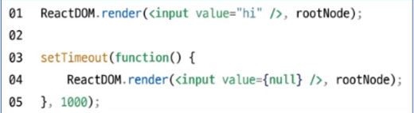
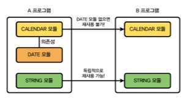

# 오재영 202130417

## 3월 20일 강의 내용 

## 리액트의 정의

리액트(React)는 웹 및 네이티브 사용자 인터페이스를 위한 라이브러리입니다. 사용자와 웹사이트의 상호작용을 돕는 인터페이스를 만들기 위한 자바스크립트 기능 모음집입니다.

## 리액트의 장점

1. **빠른 업데이트와 렌더링 속도 (Virtual DOM):** 리액트는 가상 DOM(Virtual DOM)을 사용하여 업데이트와 렌더링 속도를 향상시킵니다. 이는 실제 DOM 조작 대신 가상의 DOM을 사용하여 변화를 추적하고, 최소한의 DOM 조작만을 수행하여 성능을 최적화합니다.

2. **DOM(Document Object Model):** XML, HTML 문서의 각 항목을 계층으로 표현하며 생성, 변경, 삭제할 수 있도록 돕는 인터페이스입니다.

3. **비동기식 렌더링:** 실제 DOM 조작은 동기식이지만, 가상 DOM은 비동기식으로 렌더링됩니다.

## 컴포넌트 기반 구조

* 리액트의 모든 페이지는 컴포넌트로 구성됩니다.
* 하나의 컴포넌트는 다른 여러 개의 컴포넌트의 조합으로 구성할 수 있습니다.
* 리액트는 레고 블록을 조립하는 것처럼 컴포넌트를 조합하여 개발합니다.
* 재사용성이 뛰어나며, 각 컴포넌트는 독립적으로 작동합니다.

## 재사용성
* 반복적인 작업을 줄여주기 때문에 생산성을 높여 줍니다.
* 유지보수가 용이합니다.
* 재사용이 가능하려면 해당 모듈의 의존성이 없어야 합니다.

  

## 리액트의 단점
 
 1. 방대한 학습량
 2. 높은 상태 관리 복잡도
 
 `*교수님 피셜) 자바스크립트를 아주 잘 알필요가 없다 몰라도됨! 모든간에 지장은 없다*`
 

 

        

## 3월13일 강의 내용 
### GitHub 사용법
git init  (로그인)  
git config user.name "닉네임"  
git config user.email "cook0926@naver.com"  
it config user.name  (닉네임 확인)  
git config user.email (이메일 확인)

node -v (node 버전 확인하기)

 
 
 

https://bit.ly/3KHObfW 3-1반 깃허브 링크  
https://git-scm.com/book/ko/v2 깃 설명서

 
 

<h3>HTML 살펴보기</h3>

HTML이란 무엇인가?  
웹사이트의 뼈대를 구성하는 태그들  
SPA(Single Page Application)