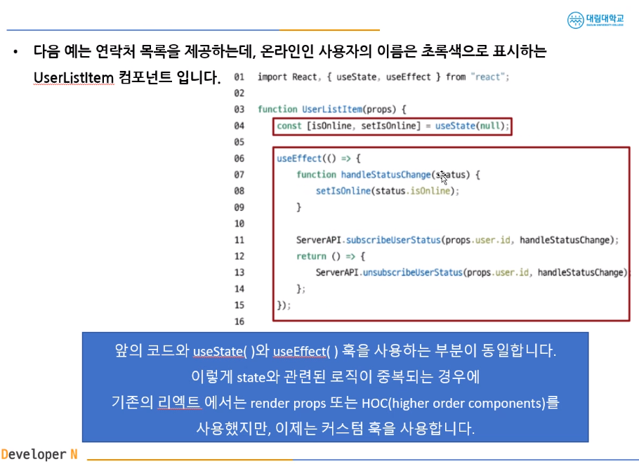

## 오재영 202130417

# <span style="color:#00ffff;">5월 8일 강의 내용 </span>
## 8장
DOM Event  
`<button onClick="activate()">Activate</button>`  
React의 Event  
`<button onClick={activate}>
  Activate
</button>`  
Event Handler  
어떤 사건이 발생하면 사건을 처리하는 역할  
EventListener로 불리기도 함

## 9장 Conditional Rendering

Conditional Rendering  
조건부 렌더링(어떠한 조건에 따라서 렌더링이 달라지는 것)
```
function Greeting(props){
  const isLoggedIn = props.isLoggedIn;
  
  if(isLoggedIn){
    return <UserGreeting />;
  }
  return <GuestGreeting />;
}
```

조건에 따라 렌더링 결과 달라짐  
Truthy true는 아니지만 true로 여겨지는 값  
Falsy false는 아니지만 false로 여겨지는 값  
``````
// truthy
true
{} (empty object)
[] (empty array)
42 (number, not zero)
"0", "false" (string, not empty)

// falsey
0, -0 (zero, minus zero)
0n (BigInt zero)
'', "", ``, (empty string)
null
undefined
NaN (not a number)
``````

Element Variables  
렌더링 된 element를 변수 취급 가능

button이란 변수에 component를 넣어 component를 렌더링

Inline Conditions
조건문을 코드안에 집어넣는 것

(1) InlineIf
&& 연산자를 사용

true && expression → expression
false && expression → false


# <span style="color:#00ffff;">5월 1일 강의 내용 </span>

## 8장
### 이벤트 핸들링


#### 둘의 차이점은
* 이벤트 이름이 onclick에서 onClick으로 변경(Camel case)
* 전달하려는 함수는 문자열에서 함수 그대로 전달.

이벤트가 발생했을 때 해당 이벤트를 처리하는 함수를 "이벤트 핸들러" 라고합니다. 또는 이벤트가 발생하는 것을 계속 듣고 있다는 의미로" 이벤트 리스너" 라고 부르기도 합니다.

### 이벤트 핸들러 추가하는 방법은?

버튼을 클릭하면 이벤트 핸들러 함수인 handleClick()함수를 호출 하도록 되어있습니다. bind을 사용하지 않으면 this.handleClick은 글로벌 스코프에서 호출되어, undefined으로 사용할 수 없기 때문입니다.
bind를 사용하지 않으려면 화살표 함수를 사용하는 방법도 있습니다.
하지만 클래스 컴포넌트는 이제 거의 사용하지 않기 때문에 이 내용은 참고만 합니다.

## 7장

## 훅의 규칙
* 첫 번째 규칙은 무조건 최상위 레벨에서만 호출해야 한다는 것입니다.
* 따라서 반복문이나 조건문 또는 중첩된 함수들 안에서 혹을 호출하면 안됩니다.
* 이 규칙에 따라서 혹은 컴포넌트가 랜더링 될 때마다 같은 순서로 호출되어야 합니다.
* 페이지 230의 코드는 조건에 따라 호출되기 때문에 잘못된 코드입니다.
* 두 번째 규칙은 함수형 컴포넌트에서만 혹을 호출해야 한다는 것입니다.
* 따라서 일반 자바스크립트 함수에서 혹을 호출하면 안됩니다.
* 혹은 함수형 컴포넌트 혹은 직접 만든 커스텀 혹에서만 호출할 수 있습니다.
* 필요하다면 직접 혹을 만들어 쓸 수도 있습니다. 이것을 커스텀 혹이라고 합니다.





# <span style="color:#00ffff;">4월 17일 강의 내용 </span>
## 훅이란 무엇인가?
* 클래스형 컴포넌트에서는 생성자에서 state를 정의하고 , setState() 함수를 통해 state를 업데이트합니다.
* 예전에 사용하던 함수형 컴포넌트는 별도로 state를 정의하거나, 컴포넌트의 생명주기에 맞춰서 어떤 코드가 실행되도록 할 수 없었습니다.
* 함수형 컴포넌트에서도 state나 생명주기 함수의 기능을 사용하게 해주기 위해 추가된 기능이 바로 훅 입니다
* 함수형 컴포넌트도 훅을 사용하여 클래스형 컴포넌트의 기능을 모두 동일하게 구현할 수 있게 되었습니다
* Hook이란 state와 생명주기 기능에 갈고리를 걸어 원하는 시점에 정해진 함수를 실행되도록 만든 함수를 의미합니다.
* 훅의 이름은 모두 'use' 로 시작합니다.
* 사용자 정의 훅을 만들 수 있으며, 이 경우에 이름은 자유롭게 할 수 있으나 'use'로 시작할 것을 권장합니다.

### useState
* useState는 함수형 컴포넌트에서 state를 사용하기 위한 Hook입니다
* 다음 예제는 버튼을 클릭 할때마다 카운트가 증가하는 함수형 컴포넌트입니다
* 하지만 증가는 시킬 수 있지만 증가할 때마다 재 렌더링은 일어나지 않습니다.

### useEffect
* useState와 함께 가장 많이 사용하는 Hook 입니다.
* 이 함수는 사이드 이팩트를 수행하기 위한것 입니다.
* 영어로 side effect는 부작용을 의미합니다. 일반적으로 프로그래밍에서 사이트 이팩트는 '개발자 가 의도하지 않은 코드가 실핻뫼녀서 버그가 발생하는 것'을 말합니다
* 하지만 리액트에서는 효과 또는 영향을 뜻하는 effect의 의미에 가깝습니다
* 예를 들면 서버에서 데이터를 받아오거나 수동으로 DOM을 변경하는 등의 작업을 의미합니다.
* 이 작업을 이팩트라고 부르는 이유는 이 작업들이 다른 컴포넌트에 영향을 미칠 수 있으며, 렌더링 중에는 작업이 완료될 수 없기 때문입니다. 렌더링이 끝난 이후에 실행되어야 하는 작업들입니다.
* 클래스 컴포넌트의 생명주기 함수와 같은 기능을 하나로 통합한 기능을 제공합니다.  
<br>
* userEffect()함수는 첫번째 파라미터는 이펙트 함수가 들어가고, 두번째 파라미터로는 의존성 배열이 들어갑니다  
`userEffect(이펙트 함수, 의존성 배열);`
* 의존성 배열은 이펙트가 의존하고 있는 배열로, 배열 안에 있는 변수 중에 하나라도 값이 변경되었을 때 이펙트 함수가 실행됩니다.
* 이펙트 함수는 처음 컴포넌트가 렌더링 된 이후, 그리고 재 렌더링 이후에 실행됩니다.
* 만약 이펙트 함수가 마운트와 언마운트 될 때만 한 번씩 실행되게 하고 싶으면 빈 배열은 넣으면 됩니다. 이경우 props나 state에 있는 어떤 값에도 의존하지 않기 때문에 여러 번 실행되지 않습니다.


### useMemo

* useMemo() 혹은 Memoizde value 를 리턴하는 훅입니다.
* 이전 계산값을 갖고 있기 때문에 연산량이 많은 작업의 반복을 피할 수 있습니다.
* 이 훅은 렌더링이 일어나는 동안 실행됩니다.
* 따라서 렌더링이 일어나는 동안 실행돼서는 안될 작업을 넣으면 안됩니다
* 예를 들면 useEffect에서 실행되어야 할 사이드 이팩트 같은 것입니다.


* 다음 코드와 같이 의존성 배열을 넣지 않을 경우, 렌더링이 일어날때마다 매번 함수가 실행됩니다.
* 따라서 의존성 배열을 얺지 않는 것은 의미가 없습니다
* 만약 빈 배열을 넣게 되면 컴포넌트 마운트 시에만 함수가 실행됩니다.

### useCallback
* useCallback() 혹은 useMemo()와 유사한 역할을 합니다
* 차이점은 값이 아닌 함수를 반환 한다는 점입니다
* 의존성 배열을 파라미터로 받는 것은 useMemo와 동일 합니다
* 파라미터로 받은 함수를 콜백이라고 부릅니다
* useMemo와 마찬가지로 의존성 배열 중 하나라도 변경되면 콜백함수를 반환합니다


### useRef
* useRef() 혹은 레퍼런스를 사용하기 위한 훅입니다.
* 레퍼런스란 특정 컴포넌트에 접근 할 수 있는 객체를 의미합니다.
* useRef() 훅은 바로 이 레퍼런스 객체를 반환합니다
* 레퍼넌스 객체에는 .current라는 속성이 있는데, 이것은 현재 참조하고 있는 엘리먼트를 의미합니다.
`const refContainer = useRef(초깃값);`

* 이렇게 반환된 레퍼런스 객체는 컴포넌트의 라이프타임 전체에 걸쳐서 유지됩니다
* 즉, 컴포넌트가 마운트 해제 전까지는 계속 유지된다는 의미입니다.

### 훅의 규칙
* 첫 번째 규칙은 무조건 최상의 레벨에서만 호출해야 한다는 것입니다. 여기서 최상위 컴포넌트는 리액트 함수 컴포넌트의 최상위 레벨을 의미
* 따라서 반복문이나 조건문 또는 중첩된 함수들 안에서 훅을 호출하면 안 된다는 것입니다.
* 훅은 컴포넌트가 렌더링 될 때마다 매번 같은 순서로 호출되어야 합니다.

# <span style="color:#00ffff;">4월 3일 강의 내용 </span>
## 컴포먼트에 대해 알아보기
* 리액트는 컴포넌트 기반의 구조를 같습니다.
* 하나의 컴포넌트는 또 다른 여러 개의 컴포넌트의 조합으로 구성 될 수 있습니다.
* 레고 블록을 조립하듯이 끼워 맞춰서 새로운 컴포넌트를 만들 수 있습니다.

## Props에 대해 알아보기
### Props의 개념   
* pros 는 prop(property : 속성 ,특성) 의 준말입니다
* 리액트 컴포넌트의 속성입니다

### Props의 특징
* 읽기 전용입니다. 변경할 수 없다는 의미 입니다.
* 속성이 다른 엘리먼트를 생성하려면 새로운 props를 컴포넌트에 전달하면 됩니다.

### Pure 함수 vs Impure 함수
* Pure함수는 인수로 받은 정보가 함수 내부에서도 변하지 않는 함수입니다
* 인수로 받은 정보를 통해 계산을 수행하고, 그 결과를 반환하지만 함수 내부에서는 외부 상태에 영향을 주지 않습니다.

### Props 사용법
* JSX에서는 key-value쌍으로 props를 구성합니다
* JSX에서는 중괄호를 사용하면 JS코드를 넣을 수 있다고 배웠습니다
* 다른 코드처럼 props를 통해서 value를 할당 할 수도 있고, 직접 중괄호를 사용하여 할당할 수도 있습니다.

* JSX를 사용하지 않는 경우 PROPS의 전달 방법은 createElement()함수를 사용하는것입니다.

## 컴포넌트 만들기
### 컴포넌트의 종류
* 리액트 초기 버전을 사용할 때는 클래스형 컴포넌트를 주로 사용했습니다.
* 이후 Hook이라는 개념이 나오면서 최근에는 함수형 컴포넌트를 주로 사용합니다.
* 예전에 작성된 코드나 문서들이 클래스형 컴포넌트를 사용하고 있기 때문에,
* 클래스형 컴포넌트와 컴포넌트의 생명주기에 관해서도 공부해 두어야 합니다.

### 함수형 컴포넌트
* Welcome 컴포넌트는 props를 받아, 받은 props중 name키의 값을 "안녕, " 뒤에 넣어 반환합니다.
### 클래스형 컴포넌트
* 상속형 컴포넌트
### 컴포넌트 이름 짖기
* 이름은 항상 대문자로 시작합니다.
* because 리액트는 소문자로 시작하는 컴포넌트를 DOM 태그로 인식하기 때문입니다. html tag,
* 컴포넌트 파일 이름과 컴포넌트 이름은 길게 합니다.

### 컴포넌트의 렌더링
* 렌더링의 과정은 다음 코드와 같습니다.


## 컴포넌트 합성
* 컴포넌트 합성은 여러 개의 컴포넌트를 합쳐서 하나의 컴포넌트를 만드는 것
* 리액트는 컴포넌트 안에 또 다른 컴포넌트를 사용 할 수 있기 때문에 복잡한 화면을 여러 컴포넌트로 나누어 구현 할 수 있습니다.
* 다음 코드에서는 props의 값을 다르게 해서 Welcome 컴포넌트를 여러 번 사용합니다.


## 컴포넌트 추출 
* 복잡한 컴포넌트를 쪼개서 여러 개의 컴포넌트로 나눌 수 도 있습니다
* 큰 컴포넌트에서 일부를 추출해서 새로운 컴포넌트를 만드는 것입니다
* 실무에서는 처음부터 1개의 컴포넌트에 하나의 기능만 사용하도록 설계하는 것
<br><br><br>


### 생명주기에 대해 알아보기
* 생명주기는 컴포넌트의 생성 시점, 사용 시점, 종료 시점을 나타내는 것입니다
* constructor가 실행 되면서 컴포넌트가 생성됩니다
* 생성 직후 componentDidMount() 함수가 호출됩니다
* 컴포넌트가 소멸하기 전까지 여러 번 랜더링 합니다
* 랜더링은 props, setState(), forceUpdata()에 의해 상태가 변경되면 이루어집니다
* 그리고 랜더링이 끝나면 componentDinUpdate() 함수가 호출됩니다
* 마지막으로 컴포넌트가 언마운트 되면 compomentWillUnmount() 함수가 호출됩니다.

 <br><br>


`책 재작자 깃허브`
https://github.com/soaple/first-met-react-practice-v18 

------------------
<br><br><br><br><br><br>
# <span style="color:#00ffff;">3월 27일 강의 내용 </span>
## Chapter 3. JSX소개
`class x`  
`function o`
### JSX(JavaScript XML)란?

* javascript에 XML을 추가한 확장 문법입니다.

### JSX의 역할


* JSX는 내부적으로 XML/HTML 코드를 자바스크립트로 변환합니다.

* React 가 createElement 함수를 사용하여 자동으로 자바스크립트로 변환해 줍니다.

* 만일 SJ작업할 경우 직접 createElement함수를 사용해야합니다.

* 앞으로 설명하는 코드를 보면 알 수 있지만 결국 JSX는 가독성을 높여 주는 역할을 합니다.

<br><Br>


### JSX의 장점
* 코드가 간결해 집니다.
* 가독성이 향상 됩니다
* Injection Attack 이라 불리는 해킹 방법을 방어합으로써 보안에 강합니다.

### JSX 사용법
* 모든 자바스크립트 문법을 지원합니다.
* 자바스크립트 문법에 XML과 HTML을 섞어서 사용합니다.
* 아래 코드의 2번 라인처럼 섞어서 사용하는 것입니다.
* 만일 HTML이나 xml에 자바스크립트 코드를 사용하고 싶으면 {}괄호를 사용합니다.


<BR><BR><BR><bR>


## Chapter 4.엘리먼트 렌더링
### 엘리먼트의 정의
* 엘리먼트는 리액트 앱을 구성하는 요소를 의미합니다.
* 공식페이지에는 "엘리먼트는 리액트 앱의 가장 작은 빌딩 블록들" 이라고 설명하고 있습니다.
* 웹사이트의 경우는 DOM 엘리먼트이며 HTML요소를 의미합니다

### 리액트 엘리먼트와 DOM엘리먼트 차이점
* 리액트 엘리먼트는 Virtual DOM의 형태를 취하고 있다.
* DOM 엘리먼트는 페이지의 모든 정보를 갖고 있어 무겁다.
* 리액트 엘리먼트는 변화한 부분만 갖고 있어 가볍다.


### 엘리먼트의 생김새

* 리액트 엘리먼트는 자바스크립트 객체의 형태로 존재합니다.
* 컴포넌트(Button 등), 속성(color 등)및 내부의 모든 children을  포함하는 일반 JS 객체입니다.
* 이객체는 마음대로 변경 할 수 없는 불변성을 갖고 있습니다.  
<br><Br>
내부적으로 자바스크립트 객체를 만드는 역할을 하는 함수는 `createElement()` 입니다

### 엘리먼트의 특징
리액트 엘리먼트의 가장 큰 특징은 불변성이다.
한번 생성된 엘리먼트의 children 이나 속성을 바꿀 수 없음

내용이 바뀌면 컴포넌트를 통해 새로운 엘리먼트를 생성하고 엘리먼트와 교체를 하는 방법으로 내용을 바꾼다 이렇게 교체하는 작업을 하기 위해 `Virtual DOM` 을 사용함

<BR> 


### 렌더링된 엘리먼트 업데이트하기
* 다음 코드는 tick() 함수를 정의하고 있음
* 이 함수는 현재 시간을 포함한 element 생성해서 root div에 렌더링 해줌
* 12라인에 setlnterval() 함수를 이용해서 위에서 정의한 tick()를 1초에 한번씩 호출 하고 있음
* 1초에 한번씩 element를 새로 만들고 그것을 교체함
* 크롬 개발자 도구를 확인해 보면 시간 부분만 업데이트 되는 것을 확인 할 수 있다.


## state
### State란?
* State는 리액트 컴포넌트의 상태를 의미합니다
* 상태의 의미는 정상인지 비정상인지가 아니라 컴포넌트의 데이터를 의미합니다
* 정확히는 컴포넌트의 변경가능한 데이터를 의미합니다
* state는 변경은 가능하다고 했지만 직접 수정해서는 안됩니다
* 불가능 하다고 생각하는 것이 좋습니다
* state를 변경하고자 할 때는 setstate()함수를 사용합니다


<br><br><br><br><br><br>
# <span style="color:#00ffff;">3월 20일 강의 내용 </span>

## Chapter 1. 리액트 소개

### 리액트의 정의

* 리액트(React)는 웹 및 네이티브 사용자 인터페이스를 위한 라이브러리입니다.  
* 사용자와 웹사이트의 상호작용을 돕는 인터페이스를 만들기 위한 자바스크립트 기능 모음집입니다.

### 리액트의 장점

1. **빠른 업데이트와 렌더링 속도 (Virtual DOM):** 리액트는 가상 DOM(Virtual DOM)을 사용하여 업데이트와 렌더링 속도를 향상시킵니다. 이는 실제 DOM 조작 대신 가상의 DOM을 사용하여 변화를 추적하고, 최소한의 DOM 조작만을 수행하여 성능을 최적화합니다.

2. **DOM(Document Object Model):** XML, HTML 문서의 각 항목을 계층으로 표현하며 생성, 변경, 삭제할 수 있도록 돕는 인터페이스입니다.

3. **비동기식 렌더링:** 실제 DOM 조작은 동기식이지만, 가상 DOM은 비동기식으로 렌더링됩니다.


### 컴포넌트 기반 구조

* 리액트의 모든 페이지는 컴포넌트로 구성됩니다.
* 하나의 컴포넌트는 다른 여러 개의 컴포넌트의 조합으로 구성할 수 있습니다.
* 리액트는 레고 블록을 조립하는 것처럼 컴포넌트를 조합하여 개발합니다.
* 재사용성이 뛰어나며, 각 컴포넌트는 독립적으로 작동합니다.

### 재사용성
* 반복적인 작업을 줄여주기 때문에 생산성을 높여 줍니다.
* 유지보수가 용이합니다.
* 재사용이 가능하려면 해당 모듈의 의존성이 없어야 합니다.

  


### 리액트의 단점
 
 1. 방대한 학습량
 2. 높은 상태 관리 복잡도
 
 `*교수님 피셜) 자바스크립트를 아주 잘 알필요가 없다 몰라도됨! 모든간에 지장은 없다*`
 
## Chapter 2. 리액트 시작하기


`npm install -g npm@10.5.0`npm 버전업  
`npx -v`npm 버전보기   
`npx create-react-app test-app`  리액트설치  
`npm start` 리액트실행 app.css 경로에서 실행해야됨!!  

`4058 경로오류`  
`4077 한번더 시도`


 


<br><br><br><br><br><br>


# 3월13일 강의 내용 
### GitHub 사용법
git init  (로그인)  
git config user.name "닉네임"  
git config user.email "cook0926@naver.com"  
it config user.name  (닉네임 확인)  
git config user.email (이메일 확인)

node -v (node 버전 확인하기)

<br>
<br>
<br>

https://bit.ly/3KHObfW 3-1반 깃허브 링크  
https://git-scm.com/book/ko/v2 깃 설명서

<br>
<br>

<h3>HTML 살펴보기</h3>

HTML이란 무엇인가?  
웹사이트의 뼈대를 구성하는 태그들  
SPA(Single Page Application)